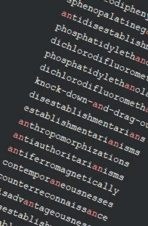
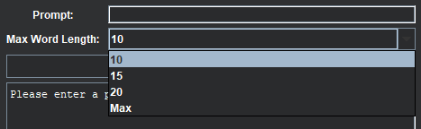
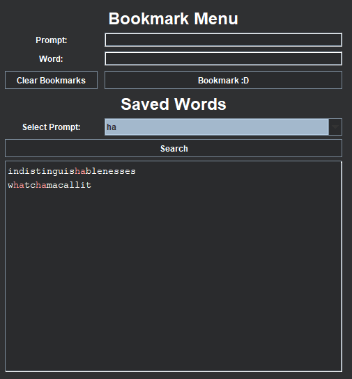
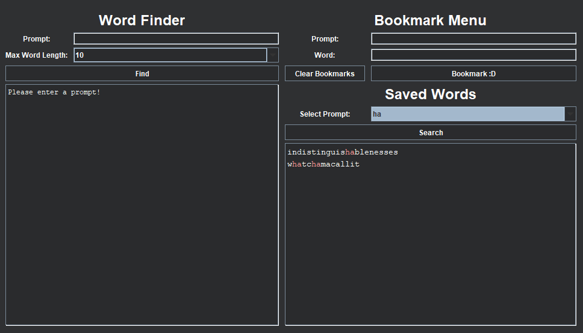

# Word Bomb Utility
This is a small and portable tool for learning new words for the Roblox game [Word Bomb](https://www.roblox.com/games/2653064683/Word-Bomb) written fully in Java.

## Disclaimer
This is not cheating software and only meant as an educational passion project made for fun and curiosity.
This app does not auto-type words, allow copying words in the game or any other forms of game exploitation.

If there are any concerns, please contact me in the Issues tab in this repository.

## Features
- **Prompt Searching With Highlighting**

- **Word Length Filtering**

- **Bookmarks**

- **Dark Mode GUI**

## Requirements
- A modern Java JRE (I recommend the latest version of [Adoptium JRE](https://adoptium.net/temurin/releases) for your platform.)

_Proper OS packages will be introduced in later versions._

### OS Support
All the listed operating systems are technically supported, however your mileage may vary.
Any reports about your experiences in an untested OS are very appreciated. <3

- Windows 10 and above
  - [X] _Tested under Windows 10_
- MacOS
  - [ ] Untested
- Linux
  - [ ] Untested

## Downloads
Head to the [releases page](https://github.com/Brecim/WordBombUtility/releases/tag/stable) and download the .jar binary file. A modern Java JRE is required to make this application run.

## Known Issues
*Currently, no issues. If there are any, then please feel free to make an issue in this repository. Feature requests are also welcome, but there is no guarantee of addition.*

## Special Thanks
Thanks to [OMG](https://www.roblox.com/communities/4585943) for developing the game and providing us with silly word fun.

I would also like to thank [artzified](https://github.com/artzified) for compiling [a nearly complete dictionary](https://github.com/Artzified/WordBombDictionary) for this game and allowing this tool to be possible.

And finally, I want to thank **you** for checking this app out <3

